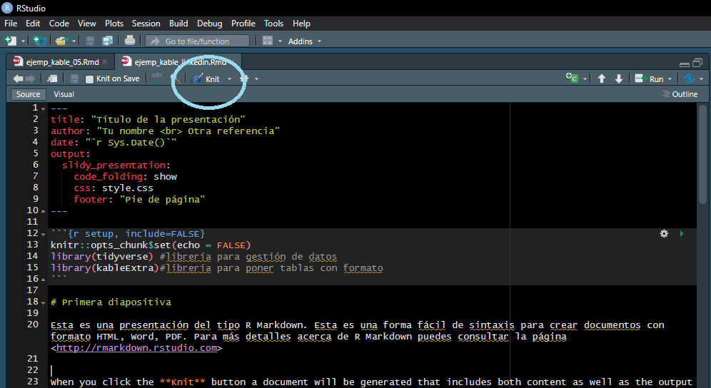

```{r setup, include=FALSE}
knitr::opts_chunk$set(echo = FALSE)
library(tidyverse) #librería para gestión de datos
library(kableExtra)#librería para poner tablas con formato 
```

# Primera diapositiva (Intro)
<br><br>
Esta es una presentación del tipo R Markdown. Esta es una forma fácil de sintaxis para crear documentos con formato HTML, Word, PDF. Para más detalles acerca de R Markdown puedes consultar la página <http://rmarkdown.rstudio.com>

En tu sesión de RStudio, cuando haces click en el botón **Knit** se genera un documento que contiene tanto el contenido así como cualquier bloque de código R en el documento.


<center>
{width=50%}
<center/>

# Segunda diapositiva (código R y gráficas)

Es posible incluir salidas R. Para esto insertas "chunks" de código. 


## Resumen de la tabla "cars"

```{r, echo=TRUE}
summary(cars)
```

## Gráficas

### Gráfica de la velocidad

Dependiendo del tipo de gráficas puedes incluir de forma sencilla algunas usando el comando "plot".

```{r, echo=TRUE}
plot(cars$speed)
```

### Otro tipo de gráficas
También puedes incluir tus propias gráficas y customizar la visualización


```{r, echo=TRUE}
# Create data 
my_variable=c(rnorm(1000 , 0 , 2) , rnorm(1000 , 9 , 2))
 
# Layout to split the screen
layout(mat = matrix(c(1,2),2,1, byrow=TRUE),  height = c(1,8))
 
# Draw the boxplot and the histogram 
par(mar=c(0, 3.1, 1.1, 2.1))
boxplot(my_variable , horizontal=TRUE , ylim=c(-10,20), xaxt="n" , col=rgb(0.8,0.8,0,0.5) , frame=F)
par(mar=c(4, 3.1, 1.1, 2.1))
hist(my_variable , breaks=40 , col=rgb(0.2,0.8,0.5,0.5) , border=F , main="" , xlab="value of the variable", xlim=c(-10,20))

```

# Tercera diapositiva (tablas)

Para el caso de las tablas se pueden usar algunos formatos útiles. Por ejemplo:

1. Usando la librería "kable":

```{r, echo=TRUE}
kable(head(mtcars[, 1:4]), "pipe")
```

2. Usando la librería "kable" y poniendo un texto que acompaña a la gráfica:
```{r, echo=TRUE}
knitr::kable(iris[1:10,], caption = "Ejemplo de texto.")
```

3. Usando la librería "kable" y __customizando__ las entradas de la tabla:
```{r, echo=TRUE}
kable(head(iris, 5), align = 'c', booktabs = TRUE) %>%
  row_spec(1, bold = TRUE, italic = TRUE) %>% 
  row_spec(2:3, color = 'white', background = 'black') %>%
  row_spec(4, underline = TRUE, monospace = TRUE) %>% 
  row_spec(5, angle = 45) %>% 
  column_spec(5, strikeout = TRUE)
```

4. Usando un data frame:
```{r}
dt <- mtcars[1:5, 1:6]
kbl(dt)

```

Tabla en la presentaición al centro,
```{r}
dt %>%
  kbl() %>%
  kable_styling()
```

Tabla interactiva (pasa el cursor por las celdas)
```{r}
dt %>%
  kbl() %>%
  kable_paper("hover", 
              full_width = F)
```

Tablas con formato LaTex
```{r}
# Estilo documento de Latex para PDF. 
dt %>%
  kbl(caption = "Recreating booktabs style table") %>%
  kable_classic(full_width = F, html_font = "Cambria")
```


# Cuarta diapositiva (Tablas interactivas)

En una presentación una tabla con la opción de búsqueda de registros es muy útil. Para esto se usa la librería "DT". 

```{r}
DT::datatable(
  head(iris, 10),
  fillContainer = FALSE, options = list(pageLength = 8)
)
```

# Ültima diapositiva (Formato LaTex)

Con R Markdown es posible incluir en la presentación texto con formato LaTex. Por ejemplo letras griegas:
$$
\begin{gather}
  \alpha \beta \gamma \delta \epsilon \zeta \eta \theta \iota \kappa \lambda \\ 
  \mu \nu \xi \pi \rho \sigma \tau \upsilon \phi \chi \psi \omega \\
  \Gamma \Delta \Theta \Lambda \Xi \Pi \Sigma \Upsilon \Phi \Psi \Omega
\end{gather}
$$

Y también ecuaciones a partir de código LaTex
$$
\begin{align*}
  \mbox{Ecuaciones de Maxwell: forma diferencial}\\
  \vec{\nabla} \cdot \vec{E} = \dfrac{\rho}{\epsilon_0}& \qquad \mbox{Ley de Gauss}\\
  \vec{\nabla} \cdot \vec{B} = 0& \qquad \mbox{Ley de Gauss para el campo magnético}\\
  \vec{\nabla}\times\vec{E}=-\dfrac{\partial \vec{B}}{\partial t}& \qquad \mbox{Ley de Faraday}\\
  c^2\vec{\nabla}\times\vec{B} =\dfrac{\vec{J}}{\epsilon_0}+\dfrac {\partial \vec{E}}{\partial t}& \qquad \mbox{1ra Ley de Ampere}\\
  \vec{\nabla}\times \vec{B}=\mu_0\vec{J}+\mu_0 \epsilon_0 \dfrac{\partial \vec{E}}{\partial t}& \qquad \mbox{2da Ley de Ampere}\\
  \\
  \mbox{Ecuaciones de Maxwell: forma integral}\\
  \oint_S \vec{E} \cdot d\vec{s} = \dfrac{q}{\epsilon_0}& \qquad \mbox{Ley de Gauss}\\
  \oint_S \vec{B} \cdot d\vec{s} = 0& \qquad \mbox{Ley de Gauss para el campo magnético}\\
  \oint_C \vec{E} \cdot d\vec{l} = -\dfrac{d}{dt} \int_S \vec{B} \cdot \vec{s}& \qquad \mbox{Ley de Faraday}\\
  c^2 \oint_C \vec{B} \cdot d\vec{l} = \int_S \dfrac{\vec{J} \cdot d\vec{s}}{\epsilon_0} + \dfrac{d}{dt} \int_S \vec{E} \cdot d\vec{s}& \qquad \mbox{1ra Ley de Ampere}\\
  \oint_C \vec{B} \cdot d\vec{l} = \mu_0 \int_S \vec{J} \cdot d\vec{s} + \mu_0 \epsilon_0 \dfrac{d}{dt} \int_S \vec{E} \cdot d\vec{s}& \qquad \mbox{2da Ley de Ampere}
\end{align*}
$$